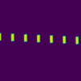
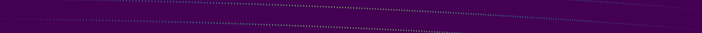

Models and their perturbation
=============================

For PyEchelle to be able to simulate a 2D spectrum, it must be given a spectrograph model.

Strictly speaking, a spectrograph model must be an instance of the (abstract) spectrograph class and therefore implement all of its methods.
This could happen by using e.g. an analytic model for all those methods. The 'SimpleSpectrograph' class is a simple minimal example.

For real world instruments, it is better to extract the necessary information from an optical design program.
See :ref:`How to create a new spectrograph model` for details how to do this in case of a ZEMAX optical model file.

Perturbations
=============
PyEchelle provides two models which are special: LocalDisturber and GlobalDisturber.
Those models take as an initialisation argument a spectrograph model (and some other parameters).
The LocalDisturber is used to perturb any given spectrograph model locally in the slit plane (e.g. by scaling,
rotating, shearing the slit/fiber image). This can be used to simulate e.g. how a rotation in the slit plane
of the spectrograph affects the resolving power/sampling.

   The LocalDisturber is here used to rotate the fibers inplace.

The GlobalDisturber on the other hand acts on the positions of the spectral lines,
but leaves the fiber shape/orientation untouched.

   The GlobalDisturber rotates here the position of all lines with respect to a reference point (here, the center of the detector).