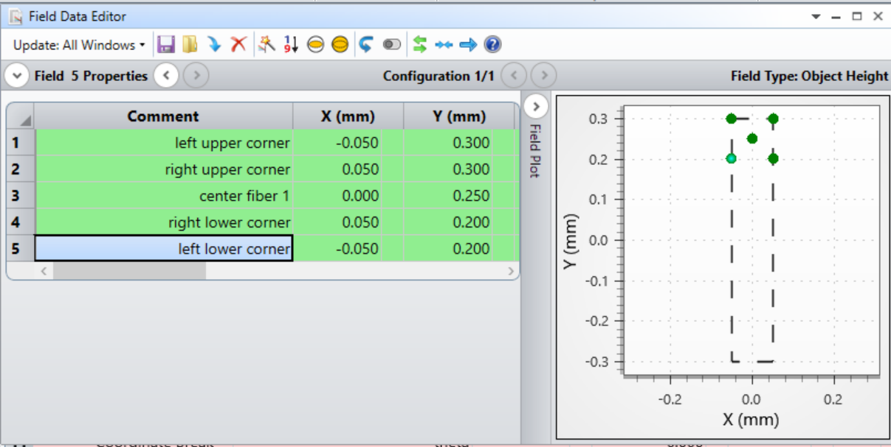

How to create a new spectrograph model
======================================

Here, we describe how to create a new model file from an existing ZEMAX design.

Make a copy
-----------
Since we are modifiyng the ZEMAX file, the first step always is to save the ZEMAX file under a new name.

Delete MultiConfigs
-------------------
Delete all MultiConfigs, in particular all Operands dealing with wavelength and the diffraction order of the grating.

Set correct fields
------------------
Now set correct field points. For each fiber/field you should enter 5 values: the center, and the 4 corners of the bounding box.

For instance, this is how it should look like for a 100micron fiber at the position (x,y) = (0.0, 0.25):

Check apertures
---------------
When tracing, it is important that the rays end up on the last surface which is assumed to be the detector, rather
than being vignetted somewhere else. In almost most cases, vignetting on surfaces prior to the detector is an indication
that the ZEMAX model should be revised. To avoid vignetting, it's typically a good idea to remove all apertures except
the one that defines the detector. The aperture on the last surface is used to determine the wavelength bounds for each
order.
